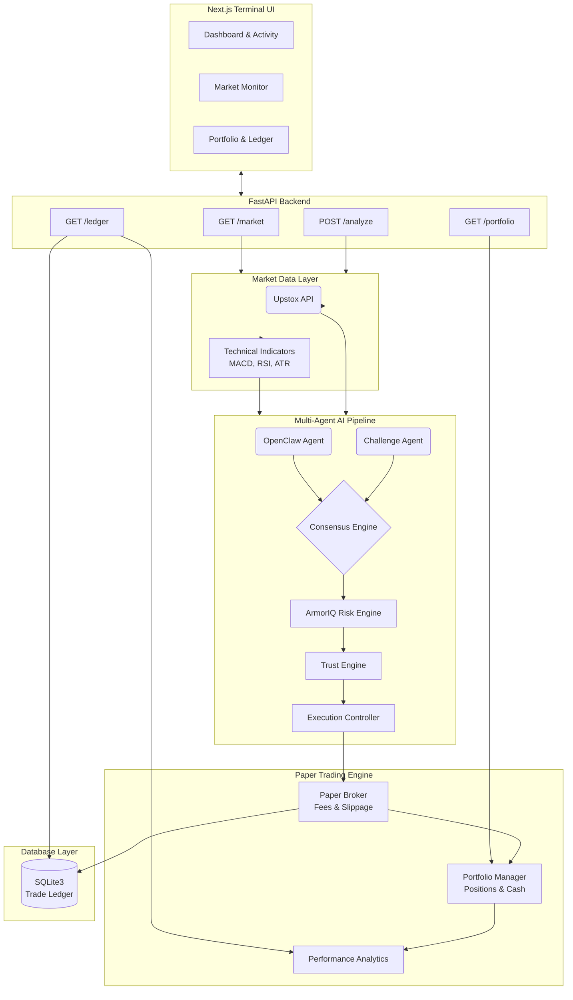

<div align="center">
  <h1>PhantomClaw v3</h1>
  <p><strong>Multi-Agent AI Algorithmic Trading System with Professional Terminal Oversight</strong></p>

  <p>
    
    
    
    
    
  </p>
</div>

PhantomClaw v3 is a state-of-the-art, multi-agent algorithmic trading system. It leverages large language models (LLMs) and specialized AI engines to evaluate market conditions, debate trading strategies, assess deterministic risk, and execute simulated trades through a highly modular Paper Trading Engine. 

Built with a **FastAPI** backend and a **Next.js** frontend, PhantomClaw provides a professional, Bloomberg-esque terminal experience for algorithmic oversight and performance analytics.

## 🤔 Why PhantomClaw?

### The Problem It Solves
Traditional algorithmic trading bots rely on rigid, hardcoded rules (e.g., "Buy when RSI < 30"). Conversely, naive "AI trading bots" often blindly trust a single LLM prompt, leading to hallucinations, ignored risk parameters, and unrecoverable drawdowns. PhantomClaw bridges this gap by marrying the adaptive reasoning of LLMs with strict, deterministic guardrails.

### A New Approach: The Multi-Agent Debate
Instead of a single point of failure, PhantomClaw utilizes an adversarial multi-agent architecture. When the primary agent (OpenClaw) proposes a trade, a dedicated **Challenge Agent** actively attempts to find holes in the thesis by cross-referencing conflicting indicators. The **Consensus Engine** then mathematically weights these arguments alongside traditional momentum and trend signals. This creates a system that "thinks" critically and debates itself before risking capital.

### Explainability and Deterministic Risk
In quantitative finance, a "black box" is unacceptable. PhantomClaw is designed for absolute transparency. 
- **Explainability:** Every trade decision generates a comprehensive audit trail, explaining exactly *why* the consensus was reached and what opposing arguments were overruled.
- **Deterministic Risk:** AI never dictates position sizing or risk management. The **ArmorIQ Risk Engine** and **Trust Engine** apply strict, mathematical constraints (based on ATR, portfolio margins, and volatility) to override or scale back the AI's enthusiasm. If a trade violates risk parameters, it is deterministically rejected.

## 📊 Current Status (Phase 6 Complete)
- [x] Multi-Agent AI Pipeline
- [x] FastAPI Backend Architecture
- [x] Upstox Live Market Data Integration
- [x] Provider Abstraction & Response Caching
- [x] Modular Paper Trading Engine (Broker, Portfolio, Ledger)
- [x] Professional Next.js Trading Terminal (Market Monitor, Trade Ledger, Analytics)

## 🌟 Key Features

### 🧠 Multi-Agent AI Pipeline
- **OpenClaw Agent:** Primary LLM-based trade analysis assessing market sentiment and indicators.
- **Consensus Engine:** Weighted voting system aggregating Momentum, Mean Reversion, and Trend signals.
- **Challenge Agent:** A "devil's advocate" agent that actively tries to invalidate the primary trade thesis.
- **ArmorIQ Risk Engine:** Deterministic risk scoring based on volatility, ATR, and account constraints.
- **Trust Engine:** Adaptive confidence calibration that dynamically scales back execution conviction in high-risk environments.

### 🏛️ Modular Paper Trading Engine
- **Decoupled Architecture:** Built on SOLID principles with abstract `BaseBroker`, `BaseFeeModel`, and `BaseSlippageModel` interfaces.
- **Portfolio Manager:** Tracks in-memory cash balances, buying power, and active positions.
- **Trade Ledger:** Append-only SQLite execution logs ensuring atomic persistence of all AI decisions and broker fills.
- **Analytics:** Native computation of Win Rate, Profit Factor, Max Drawdown, and Sharpe Ratio.

### 💻 Professional Terminal UI
- **Real-Time Data:** Live market polling via TanStack Query displaying OHLC, Volume, MACD, RSI, and ATR.
- **Dashboard & Activity Logs:** Live execution streams and AI recommendation panels.
- **Trade Ledger & Analytics:** Interactive data tables with CSV export, alongside Recharts-powered equity curves.
- **Dark-Mode First:** Built with Tailwind CSS and `shadcn/ui` for high data density and low eye strain.

---

## 🏗️ Architecture Summary



PhantomClaw operates on a unidirectional data flow:

1. **Market Data Layer:** Fetches live OHLCV data from the Upstox API and computes technical indicators (RSI, EMA, MACD, ATR).
2. **AI Orchestration:** The `analysis_service.py` runs the multi-agent pipeline sequentially, gating trades through the Execution Controller.
3. **Execution & Ledger:** Approved signals are forwarded to the `TradingEngine`. The simulated `PaperBroker` applies synthetic slippage/fees, emits a `TradeFill`, mutates the `PortfolioManager`, and writes to the SQLite `TradeLedger`.
4. **Presentation:** The Next.js frontend consumes REST endpoints (`GET /market`, `POST /analyze`, `GET /portfolio`, `GET /ledger`) via isolated React hooks, rendering the state dynamically.

---

## 🧠 AI Decision Pipeline

PhantomClaw executes every trade through a rigorous, 12-stage sequential pipeline.

### 1. Market Data
- **Purpose:** Fetches raw market OHLCV data from external providers to ensure the pipeline operates on live or accurate historical state.
- **Input:** Ticker symbol (e.g. `AAPL`).
- **Output:** Raw price snapshot and historical Pandas DataFrame.

### 2. Technical Indicators
- **Purpose:** Computes quantitative metrics over the raw price data to give AI agents mathematical context.
- **Input:** Historical OHLCV DataFrame.
- **Output:** Dictionary containing RSI, MACD, EMA20, EMA50, and ATR.

### 3. OpenClaw
- **Purpose:** The primary LLM-driven agent that evaluates market sentiment and technicals to formulate an initial trade thesis.
- **Input:** Market snapshot and technical indicators.
- **Output:** A base `TradeRecommendation` (Action, Quantity, Confidence, Reason).

### 4. Consensus Engine
- **Purpose:** A weighted mathematical voting system that aggregates the OpenClaw thesis alongside traditional quantitative agents (Momentum, Mean Reversion, Trend).
- **Input:** OpenClaw recommendation, market snapshot, technical indicators.
- **Output:** An adjusted, consensus-backed `TradeRecommendation`.

### 5. Challenge Agent
- **Purpose:** Acts as an adversarial "devil's advocate" to explicitly hunt for flaws in the consensus thesis to prevent LLM hallucination and confirmation bias.
- **Input:** Consensus `TradeRecommendation` and technical indicators.
- **Output:** A `ChallengeResult` containing supporting and opposing reasoning.

### 6. ArmorIQ
- **Purpose:** Evaluates the deterministic risk of the trade based on volatility and hard account constraints.
- **Input:** Consensus `TradeRecommendation` and ATR.
- **Output:** A `RiskAssessment` containing a numeric risk score (0-100) and risk level (LOW/MED/HIGH/EXTREME).

### 7. Trust Engine
- **Purpose:** Calibrates the system's final confidence by penalizing the trade thesis if the ArmorIQ risk score is too high relative to the agent's initial conviction.
- **Input:** Consensus `TradeRecommendation` and `RiskAssessment`.
- **Output:** A `TrustAssessment` with an adjusted trust score (0-100%).

### 8. Execution Controller
- **Purpose:** The final deterministic gatekeeper that mathematically decides if the trade meets the minimum trust threshold required to route to the broker.
- **Input:** `TrustAssessment`.
- **Output:** An `ExecutionDecision` (EXECUTE, REVIEW_REQUIRED, or REJECTED).

### 9. Trading Engine
- **Purpose:** The main orchestrator for the paper trading backend that routes approved execution decisions to the broker.
- **Input:** `ExecutionDecision`, `TradeRecommendation`, current market price.
- **Output:** Execution status and routing payload for the broker.

### 10. Paper Broker
- **Purpose:** Simulates live market execution by calculating synthetic slippage and applying brokerage fee models.
- **Input:** Routed trade payload and current market price.
- **Output:** A finalized `TradeFill` object containing the effective executed price and deducted fees.

### 11. Portfolio
- **Purpose:** An in-memory manager tracking buying power and active positions to enforce margin constraints.
- **Input:** `TradeFill`.
- **Output:** Updated cash balances and realized PnL.

### 12. Trade Ledger
- **Purpose:** Persists all atomic trade executions and AI reasoning trails to a SQLite database.
- **Input:** `TradeFill` and AI reasoning payloads.
- **Output:** Immutable database record accessible for Performance Analytics.

---

## 📐 Engineering Principles

PhantomClaw v3 is built to scale into a production trading system, strictly adhering to the following software engineering principles:

- **SOLID Principles:** The system is highly modular. The `TradingEngine` does not know how fees are calculated; it relies on the `BaseFeeModel` interface (Open/Closed Principle). The `PortfolioManager` handles only state, while the `TradeLedger` handles only persistence (Single Responsibility Principle).
- **Clean Architecture:** Domain logic (trading, AI evaluation) is completely decoupled from the delivery mechanism. The FastAPI routers (`api/routes`) contain zero business logic. They merely route requests to the core `analysis_service.py`.
- **Dependency Injection:** Key components like the Market Data Providers (e.g., `UpstoxProvider`) and Broker modules (`PaperBroker`) are abstracted behind interfaces. They are instantiated via a factory (`ProviderFactory`), allowing seamless swapping of implementations (e.g., swapping a Paper Broker for a Live Broker) without altering the core pipeline.
- **Explainable AI (XAI):** AI in trading must be auditable. The pipeline enforces explainability by requiring the primary LLM agent to output structured reasoning. The Challenge Agent then generates a counter-thesis, and all arguments are persisted immutably in the `TradeLedger`.
- **Broker Abstraction:** The `BaseBroker` class enforces a strict contract for all broker implementations (`execute_order`, `get_positions`, `get_cash`). This ensures that the simulated paper trading environment behaves identically to a live production environment.
- **Separation of Concerns:** React UI components in the frontend are strictly visual. Data fetching is abstracted into custom React hooks (`useMarketData`, `useLedger`), isolating state management and cleanly preparing the architecture for a future WebSocket integration.
- **Test-Driven Development (TDD):** The core trading engine and AI pipeline mathematically demand precision. The project maintains a robust Pytest suite (180+ tests) ensuring that position sizing, margin constraints, and API error-handling logic execute deterministically.

---

## 🛠️ Technology Stack

**Backend**
- **Language:** Python 3.10+
- **Framework:** FastAPI, Uvicorn
- **Database:** SQLite3 (Standard Library)
- **Data Science:** Pandas, NumPy
- **Testing:** Pytest (180+ passing tests)

**Frontend**
- **Framework:** Next.js 15 (App Router), React, TypeScript
- **Styling:** Tailwind CSS v4, `shadcn/ui`
- **State Management:** TanStack React Query
- **Data Visualization:** Recharts
- **Icons:** Lucide React

---

## 📂 Project Structure

```text
phantomClaw_v2/
├── api/                  # FastAPI routers, schemas, and main app definition
├── agents/               # LLM and specialized analysis agents
├── consensus/            # Weighted voting and consensus logic
├── controller/           # Execution gate logic
├── database/             # SQLite connection and schema setup
├── engines/              # ArmorIQ (Risk) and Trust engines
├── frontend/             # Next.js trading terminal UI
│   ├── src/app/          # Page layouts (Dashboard, Portfolio, Ledger)
│   ├── src/components/   # Modular UI widgets (Charts, Tables, AI Panels)
│   └── src/hooks/        # Abstracted TanStack queries for WebSocket prep
├── market/               # Technical indicator math
├── market_data/          # Upstox integration and provider abstractions
├── portfolio/            # Legacy portfolio optimizer math
├── risk/                 # Position sizing algorithms
├── services/             # Core orchestration (analysis_service.py)
├── tests/                # Pytest suite (180+ tests)
└── trading/              # Core Paper Trading Engine (Broker, Ledger, Analytics)
```

---

## 🚀 Installation Guide

### Prerequisites
- Python 3.10+
- Node.js 18+ and npm
- A valid OpenAI API Key
- Upstox API Credentials (if running live data)

### 1. Clone the Repository
```bash
git clone https://github.com/Hridayesh11/phantomClaw_v2.git
cd phantomClaw_v2
```

### 2. Setup the Backend
```bash
python -m venv .venv
source .venv/bin/activate  # On Windows: .venv\Scripts\activate
pip install -r requirements.txt
```

### 3. Setup the Frontend
```bash
cd frontend
npm install
cd ..
```

---

## ⚙️ Configuration (.env)

Create a `.env` file in the root backend directory:

```env
# AI Provider
OPENAI_API_KEY=your_openai_key
OPENAI_MODEL=gpt-4o

# Market Data (Upstox)
UPSTOX_API_KEY=your_upstox_key
UPSTOX_API_SECRET=your_upstox_secret
UPSTOX_REDIRECT_URI=https://127.0.0.1:8000/callback

# System Settings
LOG_LEVEL=INFO
FASTAPI_URL=http://localhost:8000
DATABASE_URL=sqlite:///phantomclaw.db

# Trading Configuration
PAPER_BROKERAGE_FEE_PCT=0.001
PAPER_SLIPPAGE_PCT=0.0005
```

Create an `.env.local` file inside the `frontend` directory:

```env
NEXT_PUBLIC_API_URL=http://localhost:8000
```

---

## 🏃 Running the Application

### Running the Backend
From the root directory, start the FastAPI server:
```bash
uvicorn api.main:app --reload --host 0.0.0.0 --port 8000
```
API Documentation will be available at: [http://localhost:8000/docs](http://localhost:8000/docs)

### Running the Frontend
Open a new terminal, navigate to the frontend directory, and start Next.js:
```bash
cd frontend
npm run dev
```
The terminal will be accessible at: [http://localhost:3000](http://localhost:3000)

---

## 🧪 Testing

PhantomClaw utilizes `pytest` to ensure pipeline stability, risk math accuracy, and broker constraints.

To run the test suite (currently 180+ tests passing):
```bash
pytest tests/ -v
```

---

## 🔌 API Overview

| Method | Endpoint | Description |
| :--- | :--- | :--- |
| `GET` | `/health` | Application status (DB connection, Pipeline readiness). |
| `GET` | `/market/{symbol}` | Fetches live OHLCV data and computes indicators. |
| `POST` | `/analyze/{symbol}` | Triggers the full multi-agent pipeline and executes the trade. |
| `GET` | `/portfolio` | Returns active paper trading cash balances and open positions. |
| `GET` | `/ledger` | Retrieves historical execution logs and computed performance analytics. |

---

## 📸 Screenshots

*(UI Mockups and Application Screenshots will be added here in future updates.)*

---

## 🗺️ Roadmap

### ✅ Completed
- **Phases 1-3:** FastAPI Backend Architecture, Multi-Agent AI Pipeline, Upstox Market Data Integration.
- **Phases 4-5:** Modular Paper Trading Engine (Broker, Portfolio, Ledger).
- **Phase 6:** Professional Next.js Trading Terminal (Market Monitor, Trade Ledger, Analytics).

### 🔄 In Progress
- Application Screenshots & UI Mockups documentation.

### 📅 Planned
- **Phase 7:** Live Broker Integration (Upstox, Alpaca) implementing the `BaseBroker` interface for live execution.
- **Phase 8:** WebSocket Integration replacing HTTP polling on the frontend via the established React Hooks architecture.
- **Phase 9:** Backtesting Engine allowing historical replay of the AI Pipeline across multi-year data sets.

### 🔬 Future Research
- **Vector Trade Memory (ChromaDB):** Activating the trade memory layer (currently a no-op placeholder) to allow the LLM agents to recall past trade reasoning and adjust to historical performance over time.

---

## ⚠️ Disclaimer

PhantomClaw v3 is an open-source software project intended strictly for **educational research and paper trading** simulations. 
- **Not Financial Advice:** The algorithms, AI agents, and risk evaluations generated by this system do not constitute financial advice, investment recommendations, or an endorsement of any trading strategy.
- **Live Trading Validation:** Any future integration with live brokerage environments requires extensive, independent validation and testing by the user. Do not risk real capital without thorough backtesting and source code review. You use this software entirely at your own risk.

---

## 📜 License

This project is licensed under the MIT License. See the [LICENSE](LICENSE) file for details.
