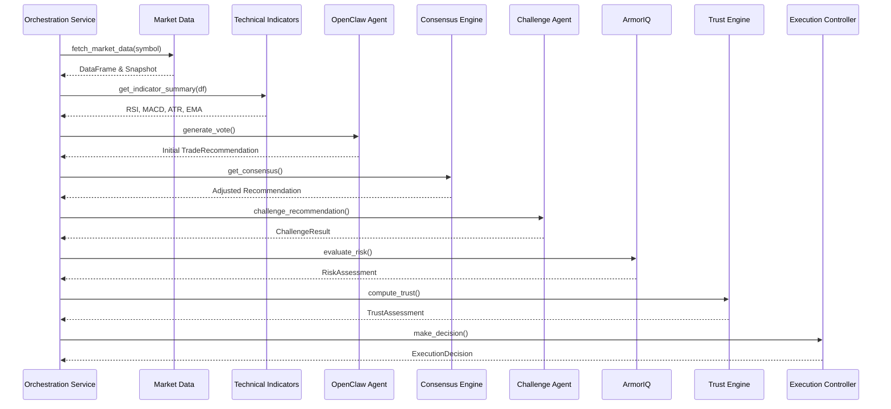

# AI Decision Pipeline

The core differentiating feature of PhantomClaw v3 is its multi-agent, adversarial decision pipeline. Rather than relying on a single stochastic prompt to an LLM, PhantomClaw mathematically weights and challenges AI theses against traditional quantitative indicators and deterministic risk models.

## Architecture

The pipeline executes strictly sequentially via `services/analysis_service.py`. Each stage acts as a functional transformer, receiving state, mutating a recommendation, and passing it to the next gate.

---

## Pipeline Stages

### 1. Market Data
- **Purpose:** Fetches raw market OHLCV data from the active `BaseMarketDataProvider` to ensure the pipeline operates on accurate live or historical state.
- **Input:** Ticker symbol (e.g. `AAPL`).
- **Output:** Raw price snapshot and a historical Pandas DataFrame.
- **Decision:** N/A (Data retrieval).
- **Failure Handling:** If data cannot be fetched after provider retries, the pipeline aborts immediately, returning an HTTP 404/500 to the client to prevent trading on stale data.

### 2. Technical Indicators
- **Purpose:** Computes quantitative metrics over the raw price data to give AI agents mathematical context without requiring them to calculate it themselves.
- **Input:** Historical OHLCV Pandas DataFrame.
- **Output:** Dictionary containing RSI, MACD, EMA20, EMA50, and ATR.
- **Decision:** N/A (Mathematical computation).
- **Failure Handling:** If math errors occur (e.g., divide by zero on flat data), safe defaults (0.0) are returned, logging a warning.

### 3. OpenClaw
- **Purpose:** The primary LLM-driven agent that evaluates market sentiment and technicals to formulate an initial trade thesis.
- **Input:** Market snapshot and technical indicators.
- **Output:** A base `TradeRecommendation` (Action: BUY/SELL/HOLD, Quantity, Confidence, Reason).
- **Decision:** Proposes the initial direction and conviction of the trade.
- **Failure Handling:** Traps OpenAI API timeouts/errors. If unrecoverable, raises a `RuntimeError` aborting the pipeline.

### 4. Consensus Engine
- **Purpose:** A weighted mathematical voting system that aggregates the OpenClaw thesis alongside traditional quantitative agents (Momentum, Mean Reversion, Trend).
- **Input:** OpenClaw recommendation, market snapshot, technical indicators.
- **Output:** An adjusted, consensus-backed `TradeRecommendation`.
- **Decision:** Can override the LLM if quantitative signals overwhelmingly disagree.
- **Failure Handling:** Gracefully handles agent failures by zeroing their weights and proceeding with the surviving votes.

### 5. Challenge Agent
- **Purpose:** Acts as an adversarial "devil's advocate" to explicitly hunt for flaws in the consensus thesis to prevent LLM hallucination and confirmation bias.
- **Input:** Consensus `TradeRecommendation` and technical indicators.
- **Output:** A `ChallengeResult` containing supporting and opposing reasoning.
- **Decision:** Provides qualitative friction to the trade thesis, appended to the explainability audit trail.
- **Failure Handling:** If the challenge agent fails to respond, the pipeline logs a warning but proceeds with the consensus trade (fail-open for audits).

### 6. ArmorIQ
- **Purpose:** Evaluates the deterministic risk of the trade based on volatility and hard account constraints.
- **Input:** Consensus `TradeRecommendation` and ATR.
- **Output:** A `RiskAssessment` containing a numeric risk score (0-100) and risk level (LOW/MED/HIGH/EXTREME).
- **Decision:** Quantifies the objective danger of executing the trade in current conditions.
- **Failure Handling:** Defaults to EXTREME risk (100) on calculation failures to trigger fail-safe rejection.

### 7. Trust Engine
- **Purpose:** Calibrates the system's final confidence by penalizing the trade thesis if the ArmorIQ risk score is too high relative to the agent's initial conviction.
- **Input:** Consensus `TradeRecommendation` and `RiskAssessment`.
- **Output:** A `TrustAssessment` with an adjusted trust score (0-100%).
- **Decision:** Modulates conviction. High risk + low consensus confidence = low trust.
- **Failure Handling:** Defaults to 0% trust on failures to prevent execution.

### 8. Execution Controller
- **Purpose:** The final deterministic gatekeeper that mathematically decides if the trade meets the minimum trust threshold required to route to the broker.
- **Input:** `TrustAssessment`.
- **Output:** An `ExecutionDecision` (EXECUTE, REVIEW_REQUIRED, or REJECTED).
- **Decision:** Binary gate. `Trust > Threshold = EXECUTE`.
- **Failure Handling:** Fails closed (`REJECTED`) if thresholds cannot be parsed.

### 9. Trading Engine
- **Purpose:** The main orchestrator for the paper trading backend that routes approved execution decisions to the broker and logs to the database.
- **Input:** `ExecutionDecision`, `TradeRecommendation`, current market price.
- **Output:** None (Mutates broker state and database).
- **Decision:** Determines if a trade can physically be executed (margin limits, portfolio constraints).
- **Failure Handling:** Rolls back database transactions if broker execution raises an exception.
