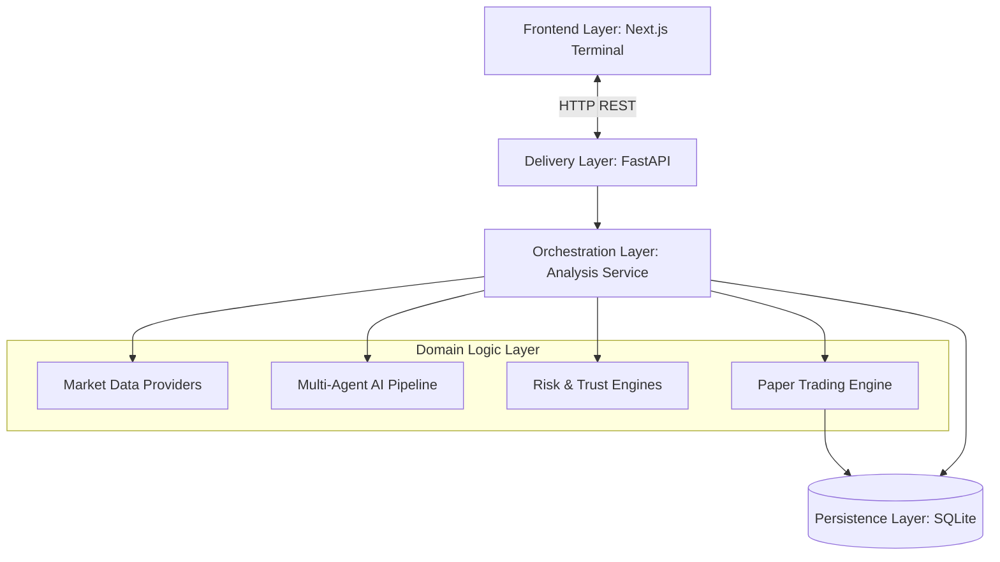
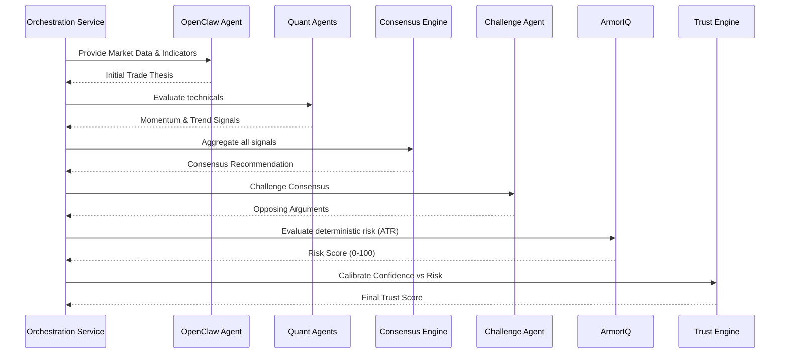
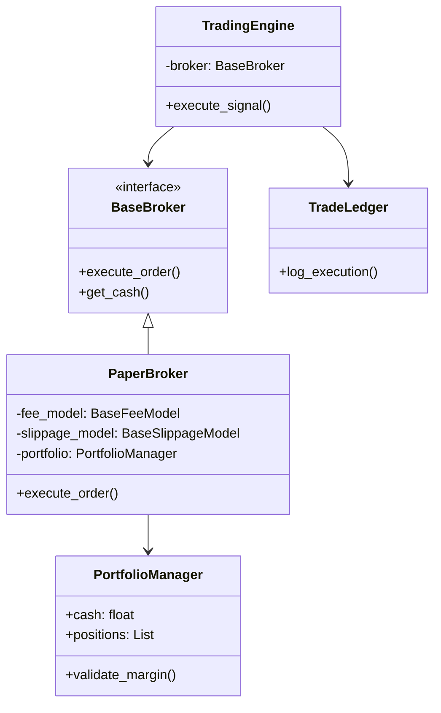

# PhantomClaw v3 Architectural Design Document

This document provides a comprehensive technical breakdown of the internal architecture of PhantomClaw v3. It is intended for software engineers, contributors, and technical recruiters seeking to understand the system's structural design, patterns, and component relationships.

---

## 1. Design Philosophy

PhantomClaw is engineered with a strict boundary between stochastic AI reasoning and deterministic financial logic. 
- **Explainable AI (XAI):** AI decisions are never executed blindly. Every thesis is challenged adversarially and requires a mathematical audit trail.
- **Determinism Overrides Stochasticity:** Large Language Models (LLMs) propose trades, but deterministic systems (ArmorIQ, Trust Engine, Portfolio Margin) strictly govern position sizing, risk constraints, and execution.
- **Unidirectional Data Flow:** State flows in one direction. The API fetches data, the pipeline mutates it into decisions, the broker executes, and the database persists.
- **Modular Boundaries:** Core domain logic is entirely agnostic to the delivery mechanism (FastAPI) and external dependencies (Upstox, OpenAI).

---

## 2. High-Level Architecture

PhantomClaw is partitioned into five distinct layers: 

1. **Frontend Layer:** React UI responsible only for state visualization.
2. **Delivery Layer:** FastAPI endpoints that parse HTTP requests and format responses.
3. **Orchestration Layer:** `analysis_service.py` coordinates the sequential pipeline.
4. **Domain Logic Layer:** The core business rules (Agents, Risk, Broker).
5. **Persistence Layer:** Append-only SQLite data stores for trade and execution logs.

---

## 3. Complete Component Breakdown

- `api/`: Contains FastAPI routers (`analyze`, `market`, `portfolio`, `ledger`, `health`) and Pydantic schemas. 
- `services/`: Houses `analysis_service.py`, the singular orchestration script for a trade lifecycle.
- `agents/`: Contains LLM implementations (`OpenClaw`, `ChallengeAgent`) and quantitative heuristic bots (`Momentum`, `Trend`, `MeanReversion`).
- `consensus/`: Houses the `ConsensusEngine` that mathematically weights differing agent opinions.
- `engines/`: Contains `ArmorIQ` (computes volatility/drawdown risk) and `TrustEngine` (calibrates LLM confidence against ArmorIQ risk).
- `controller/`: Houses the `ExecutionController`, the final boolean gatekeeper for trades.
- `trading/`: The core Trading Engine featuring the `PortfolioManager`, abstract `BaseBroker`, simulated `PaperBroker`, and `TradeLedger`.
- `market_data/`: Contains abstract `BaseMarketDataProvider` and concrete implementations like `UpstoxProvider`.
- `frontend/`: The Next.js 15 UI, completely decoupled and communicating via abstracted React Query hooks.

---

## 4. AI Pipeline

The AI decision-making process is an adversarial, multi-stage pipeline designed to eliminate hallucination.

---

## 5. Trading Engine

The Trading Engine is built on strict SOLID principles, heavily utilizing Dependency Inversion and Strategy patterns.

- **Strategy Pattern:** `PaperBroker` calculates synthetic realism by dynamically injecting `BaseFeeModel` and `BaseSlippageModel` strategies.
- **Single Responsibility:** `PortfolioManager` strictly handles active balances; it does not place orders or persist data. `TradeLedger` strictly handles database writes.

---

## 6. Frontend Architecture

The frontend is a Next.js 15 (App Router) application. It separates visual components from data fetching logic.

- **Component Layer:** Pure functional React components utilizing `shadcn/ui` and Tailwind CSS. Components do not make API calls.
- **Hook Abstraction:** All API logic is encapsulated in custom hooks (`useMarketData`, `useLedger`, `usePortfolio`) powered by TanStack React Query.
- **WebSocket Readiness:** Because UI components only consume hooks, transitioning from HTTP polling to WebSockets requires zero changes to the React trees—only the hooks need updating to subscribe to socket channels.

---

## 7. Backend Architecture

FastAPI acts strictly as a delivery mechanism. 
- **No Business Logic in Routers:** Routers inside `api/routes` only validate Pydantic schemas and delegate execution to `services/analysis_service.py` or the `TradingEngine`.
- **Async Event Loop:** API routes utilize `async/await` and thread executors for blocking computations (like Pandas math or network requests), ensuring the Uvicorn server remains non-blocking and capable of high concurrency.

---

## 8. Data Flow

A single request to evaluate and execute a trade follows this strict path:

1. **Client** POSTs to `/analyze/{symbol}`.
2. **FastAPI** validates the `{symbol}` string.
3. **Orchestrator** requests data from `ProviderFactory` -> `UpstoxProvider`.
4. **Orchestrator** passes data sequentially to Agents -> Consensus -> Risk -> Trust.
5. **Execution Controller** approves the signal.
6. **TradingEngine** receives the signal and routes it to `PaperBroker`.
7. **PaperBroker** deducts slippage, validates margin via `PortfolioManager`, and returns a `TradeFill`.
8. **Orchestrator** logs the `TradeFill` to the SQLite `TradeLedger`.
9. **FastAPI** returns the comprehensive `FullAnalysisResult` to the client.

---

## 9. Database Architecture

The persistence layer uses SQLite3 via native Python `sqlite3` driver. It operates on two primary append-only logs:

1. `trade_logs`: Stores the AI reasoning payload (Consensus reason, Challenge counter-thesis, Risk/Trust scores, Open/Close decision).
2. `execution_logs`: Stores the deterministic financial transaction emitted by the Broker (Timestamp, Symbol, Side, Quantity, Executed Price, Realized Fees, Slippage).

*Note: These are append-only ledgers to ensure true auditability of the AI's history.*

---

## 10. Dependency Relationships

The architecture relies heavily on **Dependency Injection (DI)**. 

- **Market Data:** The `analysis_service` does not import `UpstoxProvider`. It relies on a generic abstraction. A factory pattern dictates which provider is injected at runtime.
- **Brokers:** The `TradingEngine` requires a `BaseBroker`. Passing a `PaperBroker` allows simulations. In the future, passing an `AlpacaBroker` will execute live trades without changing a single line of the `TradingEngine` logic.

---

## 11. Engineering Principles

- **Clean Architecture:** Domain entities (Trade Models) sit at the center. Use Cases (Analysis Service) wrap them. Interfaces (API) sit on the perimeter. Dependencies always point inwards.
- **Separation of Concerns:** The AI Pipeline has zero awareness of cash balances. The Broker has zero awareness of RSI or LLM prompts. 
- **Test-Driven Design:** Complex math (Portfolio sizing, Margin constraints) is validated via 180+ deterministic Pytest assertions.

---

## 12. Scalability Strategy

- **Stateless Application Servers:** The FastAPI backend holds no state (aside from the singleton `TradingEngine` for paper tracking). Moving to a stateless microservice architecture is trivial.
- **Database Migration:** While currently utilizing SQLite for lightweight portability, all DB queries are abstracted. Migrating to PostgreSQL requires swapping only the connection adapter in `database/db.py`.

---

## 13. Future Extension Points

PhantomClaw is architected specifically to support the following upcoming features:

1. **Vector Memory (ChromaDB):** An existing hook (`save_memory()`) exists in the pipeline. Injecting a ChromaDB instance will allow the LLM to query historical `trade_logs` to avoid repeating past mistakes.
2. **Live Broker Implementation:** Subclassing `BaseBroker` for Alpaca or Upstox execution APIs will enable live trading seamlessly.
3. **Event-Driven WebSockets:** Upgrading the FastAPI routes to broadcast state changes (Portfolio updates, new Executions) via WebSockets, allowing the frontend hooks to instantly update the UI.
