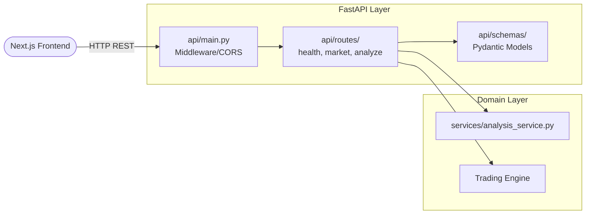

# Backend Architecture

The backend of PhantomClaw v3 is built entirely on Python 3.10+ using the **FastAPI** web framework. The backend strictly follows **Clean Architecture** principles: the web framework acts only as an delivery mechanism, entirely decoupled from the core trading and AI domain logic.

## Architecture

## Routers
Located in `api/routes/`, the routers are strictly responsible for defining the API contract, validating input via Pydantic, and returning standardized HTTP responses. 
**Crucially, routers contain zero business logic.** If a router needs to execute a trade, it calls the `analysis_service.py`.

## Services
The `services/` directory acts as the Orchestration layer. The primary entry point is `analysis_service.py`, which coordinates the Market Data Layer, the AI Pipeline, and the Trading Engine. 

## Market Data Layer Integration
The backend interfaces with the `market_data` module using dependency injection. The orchestrator requests data without knowing if it came from Upstox, Alpaca, or Yahoo Finance.

## Error Handling & Validation
- **Pydantic Validation:** All incoming and outgoing data structures are strictly validated using Pydantic schemas defined in `api/schemas/`. 
- **Global Error Handling:** FastAPI catches domain-specific exceptions (e.g., `ValueError` for bad symbols, `RuntimeError` for AI failures) and transforms them into standardized HTTP 400 or 500 responses (`ErrorResponse` schema).

## Logging
The backend uses Python's standard `logging` library. The root logger is configured in `utils/config.py` using the `LOG_LEVEL` environment variable. The AI Pipeline logs every stage transition to `stdout` for live terminal monitoring.

## Configuration
All environment variables are parsed and validated on startup by a Pydantic `BaseSettings` object in `utils/config.py`. This ensures the application crashes immediately on boot if critical secrets (like `OPENAI_API_KEY`) are missing.
