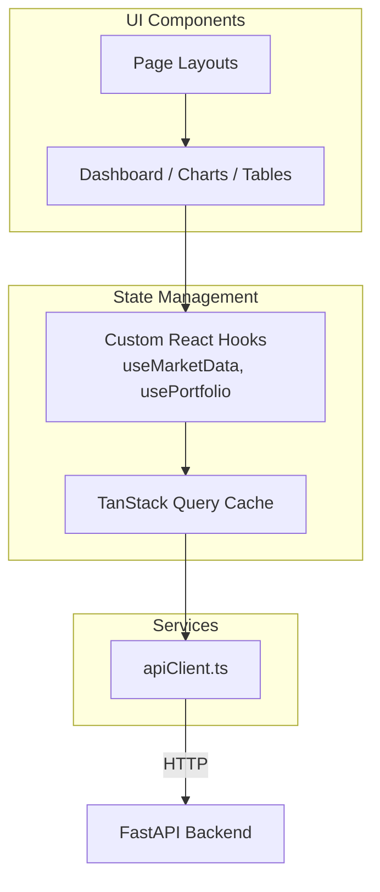

# Frontend Architecture

The PhantomClaw frontend is a professional trading terminal built with **Next.js 15 (App Router)**, **React 19**, **TypeScript**, and **Tailwind CSS v4**.

## Architecture

The frontend follows a strictly separated architecture designed to anticipate future WebSocket integrations without requiring UI rewrites.

## App Router
The application uses the modern Next.js `app/` directory structure for routing.
- `/`: The main Dashboard (Market Monitor, AI Panel, Activity Log).
- `/portfolio`: Overview of available margin and active positions.
- `/ledger`: Trade execution history and Recharts performance analytics.

## State Management & Hooks
We use **TanStack React Query** for server-state management. 
Direct API calls inside UI components are strictly forbidden. Instead, components consume custom hooks (`src/hooks/`):
- `useMarketData(symbol)`
- `usePortfolio()`
- `useLedger()`
- `useAIPipeline()`

These hooks handle caching, loading states, and background polling automatically.

## Services
The `src/services/apiClient.ts` configures an Axios instance pointing to the FastAPI backend (defined via `NEXT_PUBLIC_API_URL`). It handles base URLs and global interceptors.

## Components & Styling
UI components are built using `shadcn/ui` primitives. 
- **Dark-Mode First:** Trading terminals demand high contrast and low eye strain. The global Tailwind CSS variables in `globals.css` enforce a strict deep-charcoal theme.
- **Charts:** Performance visualizations (like the Equity Curve) are rendered fully responsively using `Recharts`.

## Future WebSocket Integration
Because data fetching is isolated entirely within the `hooks/` layer, migrating from HTTP polling to WebSockets (Phase 8) will be seamless. The UI components will not change; the hooks will simply be rewritten to subscribe to socket channels and mutate the TanStack cache directly.
