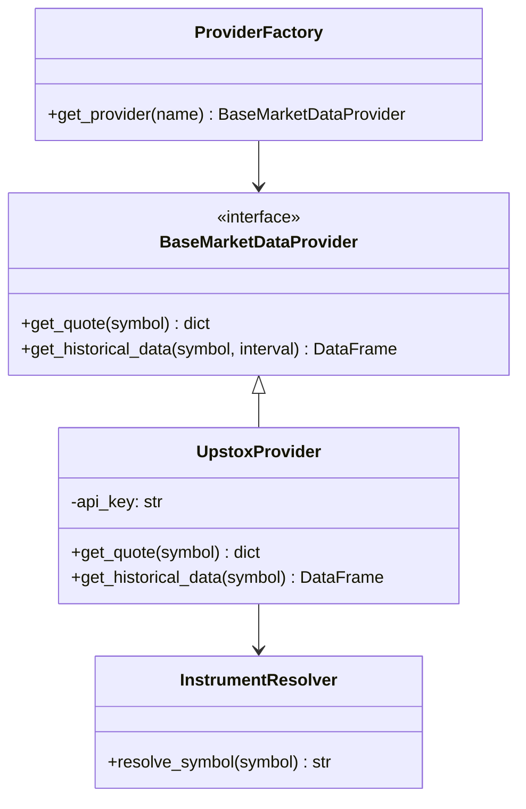

# Market Data Provider

The Market Data layer in PhantomClaw abstracts all external API interactions related to fetching live and historical prices. This abstraction ensures the core AI pipeline is decoupled from specific vendor implementations.

## Architecture

The provider layer utilizes the **Factory Pattern** and heavily implements **Decorators** for cross-cutting concerns like retries and caching.

## Important Components

### `BaseProvider`
The abstract base class enforcing the contract for market data retrieval. Any future provider (e.g., Alpaca, Polygon) must implement `get_quote` and `get_historical_data`.

### `UpstoxProvider`
The concrete implementation for the Indian stock market, interacting with the Upstox API. It maps standard ticker requests to the Upstox-specific `instrument_key`.

### `InstrumentResolver`
An internal mapping utility. LLMs often suggest plain-text tickers (e.g., `RELIANCE`). The `UpstoxProvider` requires a specific exchange key (e.g., `NSE_EQ|INE002A01018`). The resolver maintains this mapping to ensure seamless LLM-to-API translation.

### Retry Layer (`retry.py`)
Network requests to external APIs are inherently flaky. The `@with_retry` decorator automatically intercepts `HTTP 429` (Too Many Requests) or `500` errors, applying exponential backoff before failing, ensuring the AI pipeline is not aborted due to transient network drops.

### Caching
Market data requests are aggressively cached in-memory (e.g., via `@lru_cache` or TTL caches) to prevent hitting rate limits when multiple agents request the same historical data frame during a single consensus cycle.

## Data Flow

1. **Request:** `analysis_service.py` calls `fetch_market_data("RELIANCE")`.
2. **Resolution:** The active provider queries `InstrumentResolver` to map "RELIANCE" to the vendor-specific key.
3. **Retrieval:** The provider executes the HTTP request. The `Retry Layer` wraps the call to handle rate limits.
4. **Formatting:** The raw JSON response is parsed into a standardized Pandas DataFrame containing `timestamp`, `open`, `high`, `low`, `close`, and `volume`.
5. **Return:** The DataFrame is returned to the orchestrator for technical indicator computation.
