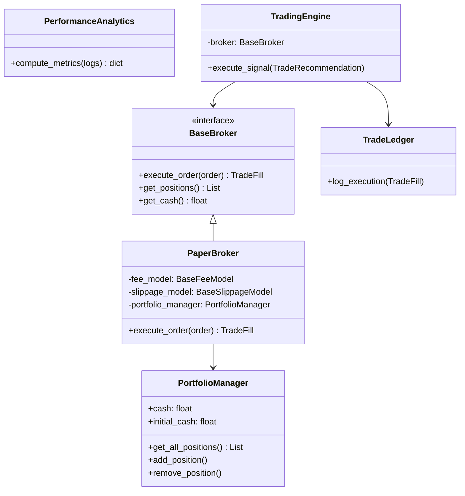

# Trading Engine

The PhantomClaw Trading Engine is a strictly typed, modular system responsible for simulated execution, margin validation, portfolio tracking, and performance analytics. It sits behind the AI Pipeline, executing only trades that have passed the `ExecutionController`.

## Architecture

The engine utilizes **Dependency Injection** and the **Strategy Pattern** to ensure strict separation of concerns, fulfilling the SOLID principles.

## Important Classes

### `TradingEngine`
The orchestrator of the execution layer. It receives an `ExecutionDecision` and a `TradeRecommendation`. If the decision is `EXECUTE`, it transforms the recommendation into an `Order` and routes it to the injected `BaseBroker`. 

### `BaseBroker` & `PaperBroker`
`BaseBroker` is the abstract interface defining the contract for any brokerage integration.
`PaperBroker` is the concrete implementation used for simulated trading. It calculates synthetic realism by dynamically applying fee and slippage models before updating the portfolio.

### `PortfolioManager`
An in-memory, singleton-like ledger tracking the active cash balance and open positions. It provides the source of truth for buying power and prevents the broker from executing trades that exceed available margin.

### `TradeLedger`
A database wrapper that strictly handles persistence. Once the `PaperBroker` emits a `TradeFill`, the engine passes it to the `TradeLedger` to execute an append-only write to the SQLite `execution_logs` table.

### `PerformanceAnalytics`
A static utility class that consumes the raw execution logs generated by the `TradeLedger` to calculate aggregate metrics (Win Rate, Profit Factor, Sharpe Ratio, Max Drawdown).

## Execution Lifecycle

1. **Signal Generation:** `analysis_service.py` passes a `TradeRecommendation` to `TradingEngine.execute_signal()`.
2. **Margin Validation:** `TradingEngine` requests the `PaperBroker` to execute the order. The `PaperBroker` queries the `PortfolioManager` to ensure sufficient cash.
3. **Slippage & Fees:** `PaperBroker` applies the `BaseSlippageModel` (adjusting the execution price unfavorably) and the `BaseFeeModel` (deducting a percentage or flat fee).
4. **Execution:** The `PortfolioManager` is mutated (cash is deducted, position is added).
5. **TradeFill:** The `PaperBroker` returns a `TradeFill` object containing the final executed price, deducted fees, and timestamp.
6. **Persistence:** `TradingEngine` passes the `TradeFill` to the `TradeLedger` for SQLite persistence.

## PnL Calculations

PhantomClaw currently tracks **Realized PnL** on a First-In-First-Out (FIFO) basis for paper trading. 
- **Unrealized PnL** requires continuous live price feeds for all open positions, which is handled dynamically by the frontend pulling live quotes against average entry prices.
- **Realized PnL** is mathematically locked when a `SELL` order executes against an existing position, factoring in the synthetic fees and slippage.
